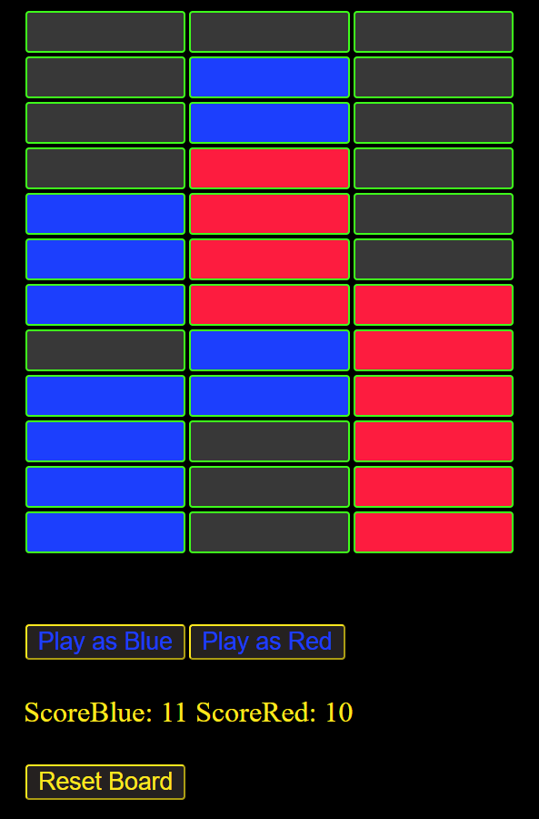

# DotRace

This project is live at endpoint https://machine100.github.io/_DotRaceDeploy/

2 players open the web address on their phones. The two players pick their colors then race to claim all spaces.

Changes made on one phone are pushed out live to the other phone. Works on desktop and mobile.

Uses Angular, Typescript, pub-sub Observable streams, and Firebase.

